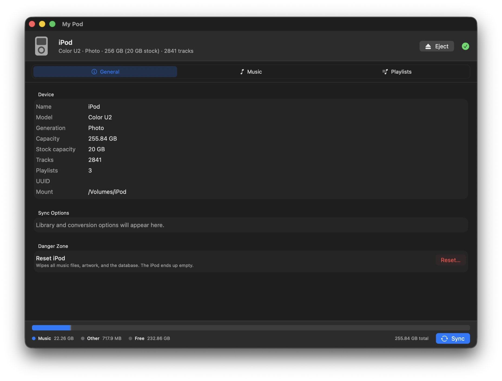
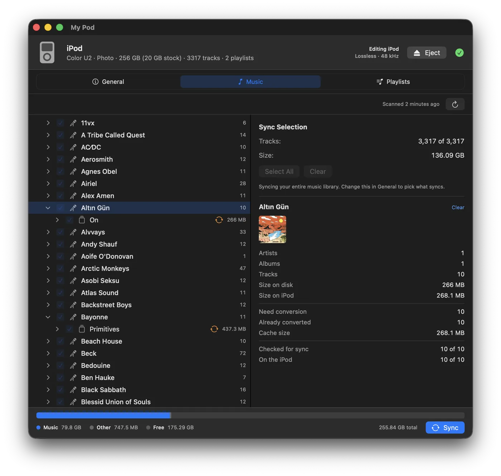
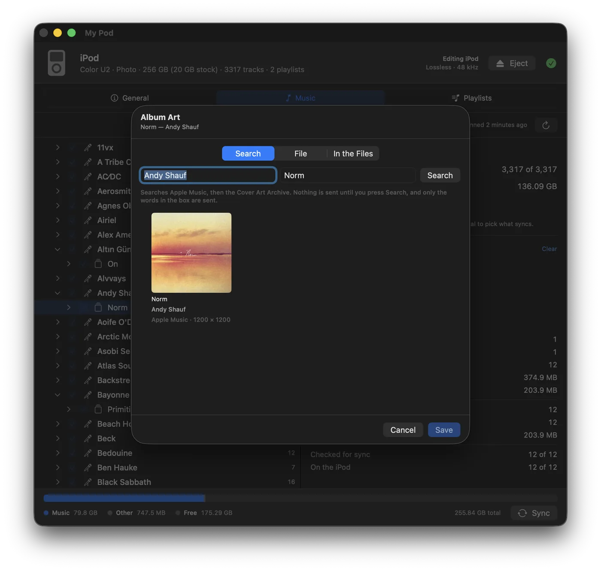
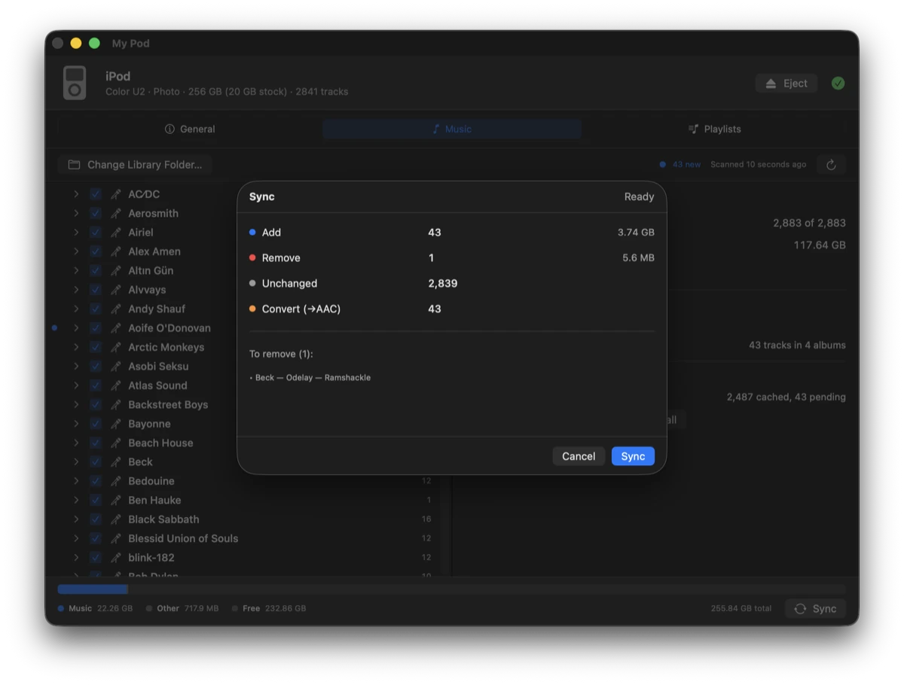
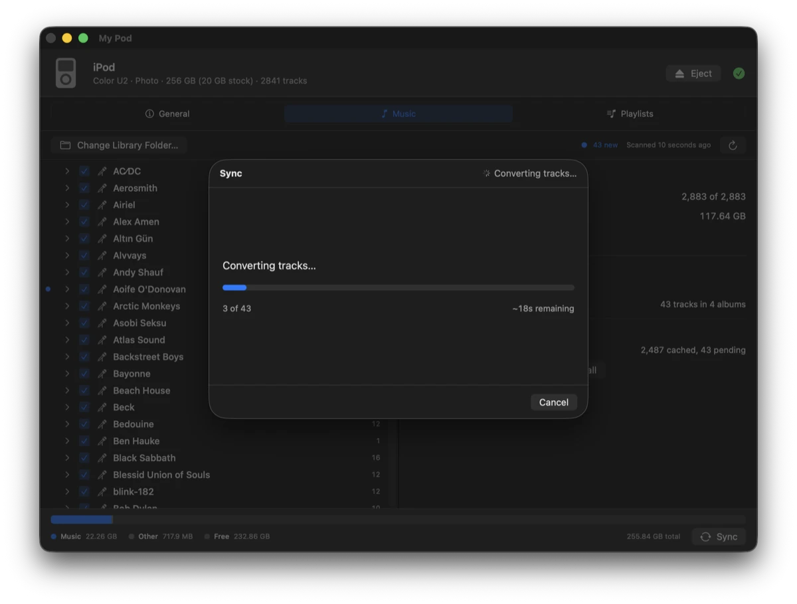
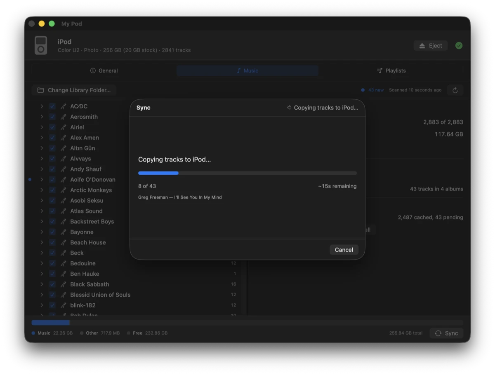
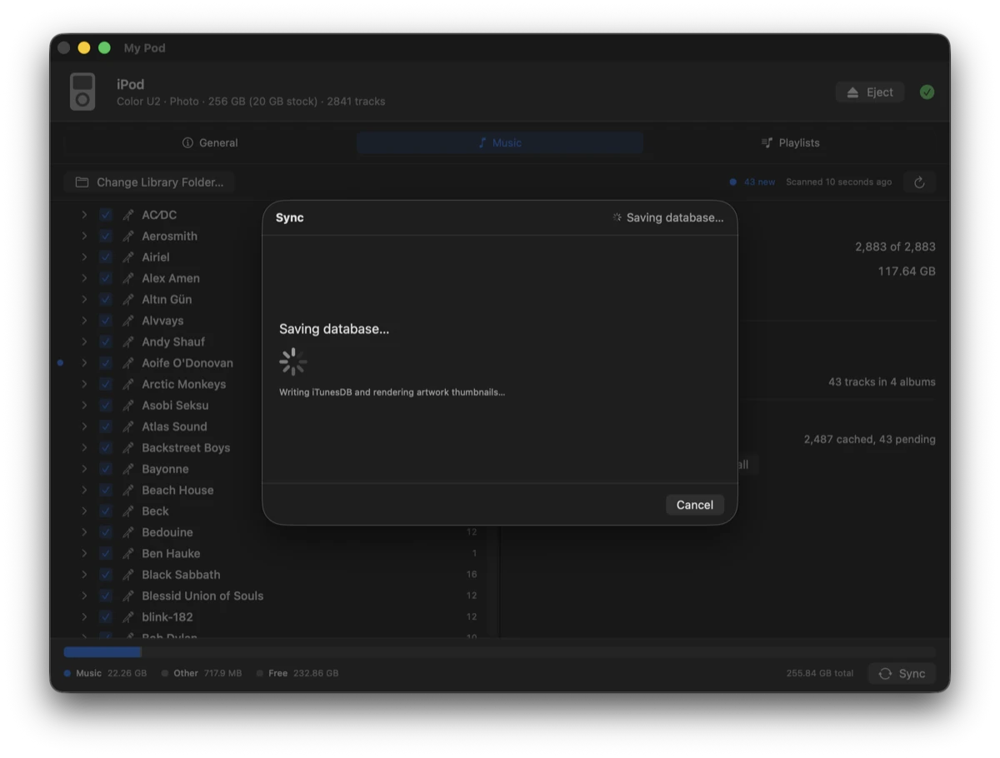
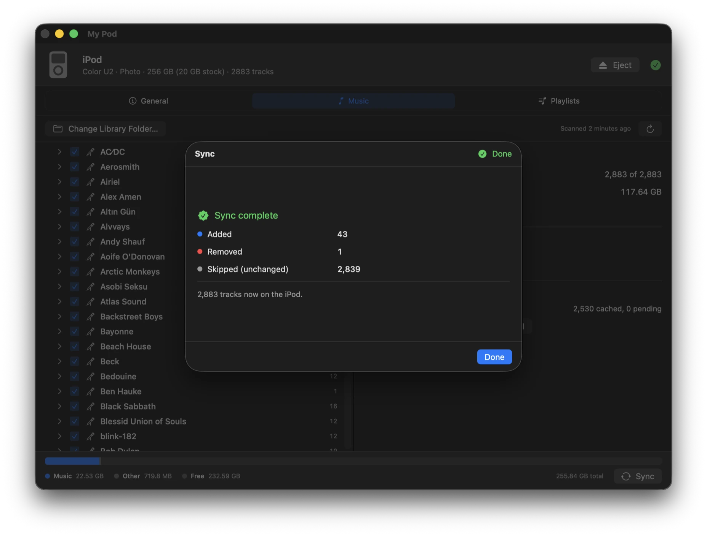
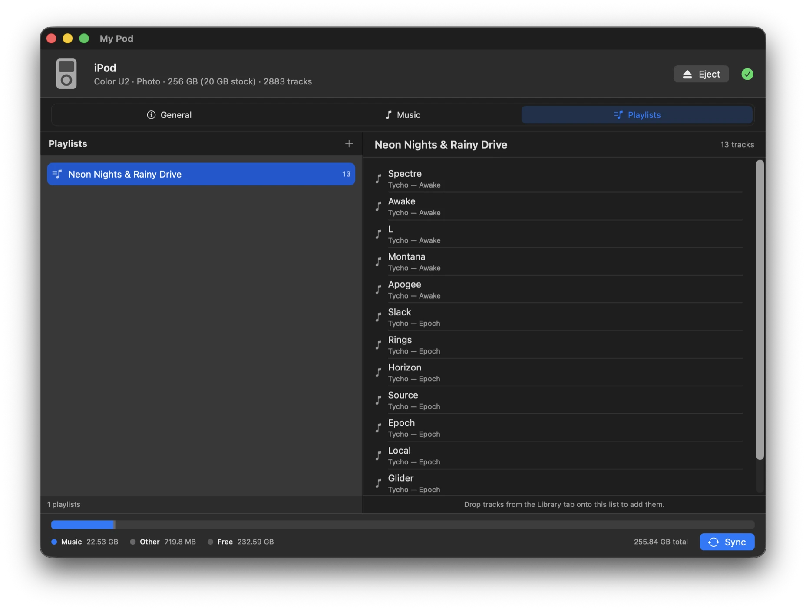

# My Pod

A native macOS app for syncing music to classic iPods, built on [libgpod](https://gitlab.gnome.org/Archive/libgpod).

Apple removed iPod support from macOS years ago. My Pod puts a modern SwiftUI interface on top of libgpod so a click-wheel iPod can still be kept in sync with a music library on disk — including transcoding formats the iPod can't play, writing cover art, and syncing playlists.



## Features

- **Automatic device detection** — the iPod is picked up as soon as it mounts; no pairing or setup.
- **Library mirroring** — pick a Plex-structured folder (`Root/Artist/Album/Track`) and either sync all of it or check the artists, albums and tracks you want. Sync is a two-way mirror: checked music is added, unchecked music is removed.
- **Manual mode** — an iPod can be managed by hand instead of mirrored, the way iTunes' *Manually manage music* did. Add and remove tracks yourself in the Manual tab and that iPod never syncs with your library, so nothing is removed behind your back. It's a per-iPod choice, so one iPod can mirror your library while another is curated by hand.
- **New-music highlighting** — anything in your library that isn't on the iPod is marked with a dot, rolled up onto album and artist rows, and counted in the toolbar.
- **Selection details** — click an artist, album or track and the panel beside the library tells you what it is: cover art, formats, sizes on disk and on the iPod, what's been converted, and what's already on the device. Shift-click to roll several together.
- **One setting per iPod** — each iPod remembers its own quality ceiling *and* its own checked music. A modded classic with a 256 GB card can hold a lossless library while an 8 GB nano gets as much AAC as fits, and plugging one in switches to its settings without touching the other's. Converted music is kept separately for each quality in use, so swapping between iPods doesn't re-encode anything.
- **Transcoding** — FLAC, OGG, Opus, WMA and APE are converted via `afconvert` and cached, so a given file is only ever encoded once. AAC 256 kbps by default; the connected iPod's ceiling is in the General tab, and Settings ▸ Conversion sets what a new iPod starts at — raising it to Apple Lossless keeps lossless music lossless. Conversion runs across several cores at once. The cache lives outside your music library by default; Settings ▸ Cache can put it back beside the music, breaks down what each quality is using, and clears it. Files that are *already* AAC or ALAC get checked rather than trusted: hi-res, 24-bit and HE-AAC ones are re-encoded too, since a click-wheel iPod skips or muffles them.
- **Cover art** — artwork is located per album and written into the iPod's database as rendered thumbnails. Albums missing a cover are flagged in the selection panel, and **Album Art** fills the gap three ways: search an online catalogue, drop in your own image, or lift a picture back out of the audio files themselves. Whatever you pick is squared — crop or fit, your choice, previewed before it's written — and saved as `cover.jpg` beside the music, where other apps can see it too. Art added to an album the iPod already holds is pushed to the device on the next sync, without re-copying the music. Some iPods can't display artwork at all — 1st to 4th generation, mini and shuffle — and the app says which rather than letting you wonder.
- **Identifying a restored iPod** — an iPod restored by Finder, or by Windows, arrives without the small file recording which model it is, and nothing modern puts it back. libgpod then can't tell what size thumbnails the device wants and writes **no album art at all** — silently, while the sync reports success. My Pod says so rather than looking clean, and **Identify iPod…** writes the file for you: pick the generation, then the colour and size. Album art already on the device is repaired too, and **General ▸ Album art ▸ Send All Again** re-sends every cover on demand.
- **Check for updates** — My Pod ▸ Check for Updates… asks GitHub whether there's a newer release and shows what's in it, with a link to the download page. Nothing is downloaded or installed for you.
- **Nothing leaves your machine unless you ask** — two features use the network, the artwork search and the update check, and both only when you press the button. Nothing is sent at launch, on a timer, while scanning, or during a sync. There is no analytics, no telemetry, and no automatic update check.
- **Playlists** — read from a folder of plain `.m3u` files. Checking a playlist syncs the tracks it contains, so you can put music on the iPod by playlist alone.
- **Capacity checking** — the storage bar previews what a sync will add and free before you run it, and a sync that wouldn't fit is refused with the shortfall named rather than failing partway through.
- **Dock progress** — sync progress is drawn onto the app icon, so you can start a sync and switch away.

### Browsing and selecting music

The Music tab is the library. Checkboxes drive what syncs; the dot marks what isn't on the iPod yet.



### Filling in missing cover art

**Album Art** covers an album three ways: search Apple Music and the Cover Art Archive, drop in a
file of your own, or lift a picture back out of the audio files. Nothing is sent until you press
Search, and only the words in the two boxes go.



### Reviewing a sync before it runs

Nothing is written until you confirm. The plan shows exactly what will be added, removed, left alone, and transcoded.



### Running the sync

Sync runs in phases, each with its own progress and a working cancel. Cancelling finishes the current track and saves what's already been done, so the iPod is never left mid-write.

| Converting | Copying |
|---|---|
|  |  |

| Saving | Complete |
|---|---|
|  |  |

### Playlists

Read from a folder of plain `.m3u` files (`~/Music/MyPodPlaylists/` unless you point it elsewhere), so anything can read or write them. Checking one syncs both the playlist and the tracks it references — you don't have to check those tracks separately in the Music tab.

Playlists are authored outside My Pod for now: build them in Finder, a text editor, or any music app that writes `.m3u`, then hit Refresh. An in-app editor will come back once it can pull tracks across from the library.



## Download

Grab the latest build for your Mac from [Releases](https://github.com/studio-rischio/My-Pod/releases)
— `My-Pod-*-arm64.zip` for Apple silicon, `My-Pod-*-x86_64.zip` for Intel — unzip it, and drag
`My Pod.app` to `/Applications`. Everything it needs is inside the bundle, so no Homebrew is
required to run it.

Not sure which you need? **Apple menu ▸ About This Mac**: a chip named *Apple M1* or later is Apple
silicon; anything named *Intel* is the other one.

The app is signed ad-hoc rather than with an Apple Developer ID, so macOS quarantines it on download
and reports it as damaged. Clear the quarantine flag once:

```bash
xattr -dr com.apple.quarantine "/Applications/My Pod.app"
```

Or open it the first time via System Settings → Privacy & Security → **Open Anyway**. Building from
source avoids this entirely.

## Connecting the iPod

My Pod detects the iPod the moment macOS mounts it as a disk, so a click-wheel iPod has to be in
disk mode before it shows up at all. That used to be the *Enable disk use* checkbox in iTunes;
since modern macOS dropped iPod support, forcing disk mode by hand is what replaces it:

1. If the iPod has a **Hold** switch, slide it on, then back off.
2. Hold **Menu** and the **centre button** together until the Apple logo appears — roughly 6 to 10
   seconds.
3. The moment the logo shows, hold the **centre button** and **Play/Pause** until the screen reads
   *Disk Mode* or *OK to disconnect*.

The iPod stays in disk mode until it's reset again, so you can sync as normal from there. Eject it
in My Pod before unplugging, then hold Menu and the centre button once more to boot it back to the
music menu.

Plenty of iPods mount on their own, having had disk use switched on by whatever last synced them —
if yours already appears in My Pod, none of this is needed.

## Requirements

These are for building from source; the release download needs none of them.

- macOS 14 or later
- Xcode 26 or later
- Homebrew

Install the C dependencies:

```bash
brew install glib pkg-config
```

The first build also generates libgpod's `configure` script, which needs the autotools. These aren't required for subsequent builds:

```bash
brew install autoconf automake libtool gtk-doc intltool
```

## Building

```bash
git clone https://github.com/studio-rischio/My-Pod.git
cd My-Pod
./build.sh
```

`build.sh` compiles the vendored libgpod into a static library (first run only — it takes a few minutes), builds the app, and launches it. Use `./build.sh build` to skip launching, or `./build.sh clean` to remove all build output.

You can also open `My Pod.xcodeproj` and build normally; a run-script phase builds libgpod if it's missing.

### Building for Intel

```bash
ARCH=x86_64 ./build.sh build
```

This works from an Apple silicon Mac. Homebrew there installs arm64-only libraries, so the Intel build can't use them — instead `Scripts/fetch-intel-deps.sh` downloads Homebrew's last x86_64 bottles into `Vendor/intel-deps/` and libgpod is cross-compiled against those. `build.sh` runs it for you. The result lands in `build-x86_64/` rather than `build/`, so both architectures can coexist.

## Project layout

```
core/            Platform-neutral C, shared with future ports
  ipod-api/      C shim exposing libgpod (ipod-api.c/.h)
  libgpod/       Vendored libgpod (modified fork), statically linked
My Pod/          macOS app source (Swift)
  Models/        Value types — library, tracks, sync plan, device
  Services/      Scanning, conversion, sync engine, device control
  Views/         SwiftUI interface
Scripts/         build-libgpod.sh, fetch-intel-deps.sh, bundle-app.sh
Config/          MyPod.xcconfig — search paths, link flags, sandbox settings
docs/            Project page (GitHub Pages) and its screenshots
icon/            App icon design source
```

Swift talks to libgpod through `core/ipod-api/ipod-api.c`, a small C wrapper that keeps GLib's memory semantics (`GList`, `GHashTable`, `GError`) out of Swift. Everything above it is ordinary Swift.

## How it works

**Library layout.** Music is read from a Plex-style tree — `Root/Artist/Album/Track`. Track numbers and titles are parsed from filenames.

**What syncs.** General ▸ Library offers the same two choices iTunes did: *Entire music library*, or *Selected playlists, artists and albums*. In the second mode the checkboxes in the Music and Playlists tabs decide what goes, and a checked playlist also selects the tracks it points at — so checking one playlist and nothing else puts exactly that playlist's music on the iPod. Tracks held on by a playlist show a checked, greyed-out box; uncheck the playlist to release them.

Or neither: General ▸ Management can set an iPod to *Manual mode*, where it never syncs and you add and remove music yourself in the Manual tab. That's per iPod, so it doesn't affect any other device.

**Matching.** The iPod's database doesn't store source file paths, so library tracks are matched to device tracks on `(artist, album, title)`, Unicode-normalised so accented titles compare equal across the filesystem and the database.

**Transcoding.** Formats the iPod can't play are encoded with `afconvert` to AAC-LC 256 kbps, constrained VBR, at 44.1 kHz by default. Those specifics matter on older hardware: true VBR breaks seeking on an iPod Photo, and hi-res sources passed through at 48 or 96 kHz skip during playback. The conversion cache is versioned, so changing the encoder settings invalidates it automatically.

**Where converted files go.** By default `~/Library/Application Support/My Pod`, so your music folders are never written to — which matters if your library is read-only, on a network share, or synced by something like Dropbox. Settings ▸ Cache can instead keep each conversion in a hidden `.mypod/` folder beside its source, which means the cache survives moving or renaming your library, at the cost of writing into it. Either way the same tab reports what each location is using and can empty it.

**What counts as playable.** A file extension isn't proof — `.m4a` covers both 256 kbps AAC and 24-bit/96 kHz ALAC, and only one of those plays properly. Natively wrapped files are opened and inspected, and re-encoded when their contents are above the ceiling: too high a sample rate, lossless too deep, or any HE-AAC — the first two adjustable in Settings ▸ Conversion, the last never, since a click-wheel decoder plays HE-AAC audibly wrong rather than not at all. HE-AAC has to be read out of the codec layer list, because such a file reports itself as an ordinary half-rate AAC stream and would otherwise slip through and play back muffled. MP3s are exempt from the check, since the format can't exceed what the hardware handles.

**Why it converts more than it strictly has to.** Those rules are deliberately conservative, and some files that get re-encoded would probably have played fine. That's the intended trade. An unnecessary re-encode costs a little quality on a device whose output stage is 16-bit anyway; a file that turns out to be unplayable costs a track that silently skips or refuses to start, with nothing on screen to explain why. Testing on an iPod Photo, for example, found 48 kHz files playing cleanly — but the original reason for forcing 44.1 kHz was *intermittent* skipping over a full album, which a short test can't rule out. So that's where the default sits.

**The quality ceiling.** Settings ▸ Conversion sets the highest quality My Pod will put on the iPod, and it works as a ceiling rather than a target: music above it is brought down to it, music below it is left exactly as it is. A 128 kbps MP3 stays a 128 kbps MP3 at every setting — re-encoding it would cost quality to gain nothing.

| Setting | What it does |
|---|---|
| **AAC 256 kbps · 44.1 kHz** | Default. The one every click-wheel iPod is known to handle. |
| **AAC 256 kbps · 48 kHz** | 48 kHz files play as-is instead of being re-encoded. |
| **Apple Lossless · 16-bit / 44.1 kHz** | FLAC and other lossless music stays lossless — roughly 3× larger on the iPod. |
| **Apple Lossless · 24-bit / 48 kHz** | Also passes 24-bit lossless through untouched. |

Everything above the default was verified on an iPod Photo; older models have been reported to skip at 48 kHz, so raising it is opt-in. Music at 96 and 192 kHz is converted whatever you pick — that refuses to play outright.

Lossy music (OGG, Opus, WMA) always becomes AAC, even under a lossless setting: converting it to Apple Lossless would make it several times larger and recover nothing, because the detail was discarded when it was first encoded.

Only one format is cached at a time, so changing this deletes the converted files and encodes them again — My Pod asks first. Your original music is never touched.

The goal is that a sync always works by default, not that it extracts every last bit of fidelity the hardware can theoretically manage. If you'd rather have the latter, [Rockbox](https://www.rockbox.org) replaces the iPod's firmware and plays considerably more than the stock software will.

**Metadata.** `afconvert` output carries no tags, so title, artist, album and artwork are written directly into the iPod database rather than embedded in the file. The iPod displays everything correctly; previewing a cached `.m4a` in Finder or Music.app will show no tags.

## Acknowledgements

Built on [libgpod](https://gitlab.gnome.org/Archive/libgpod), which does the real work of reading and writing the iTunesDB format. The copy in `core/libgpod` is a modified fork.

## How this was built

This project was built with heavy use of [Claude Code](https://claude.com/claude-code), Anthropic's AI coding assistant. Commits it contributed to carry a `Co-Authored-By` trailer, so the record is in the git history rather than only here.

What that does and doesn't mean: the architecture, the hardware constraints the app works around, and the decision about what actually ships are human calls. There is no automated test suite in this repository — verification is done by building the app and syncing to real click-wheel iPods, and that's how every release is checked before it goes out.

This section exists because people asked. If you're running software on hardware you care about, it's fair to know how it was made.

## License

The split follows the directory layout:

| Path | License |
|---|---|
| `My Pod/`, `Scripts/`, `Config/`, root build scripts | [MIT](LICENSE) |
| `core/libgpod/` | LGPL 2.1 or later |

`core/ipod-api/ipod-api.c` is MIT despite linking libgpod. It contains no libgpod code — it calls the public API and includes `itdb.h`, which LGPL 2.1 §5 defines as a *"work that uses the Library"* rather than a derivative work.

Because libgpod is linked **statically**, LGPL 2.1 §6 requires that anyone distributing a compiled binary also provide the source or object files needed to relink against a modified libgpod. Distributing this repository's source satisfies that; shipping a prebuilt `.app` or disk image on its own does not.

## Trademarks

iPod, iTunes and macOS are trademarks of Apple Inc. This project is not affiliated with, authorised by, or endorsed by Apple.
